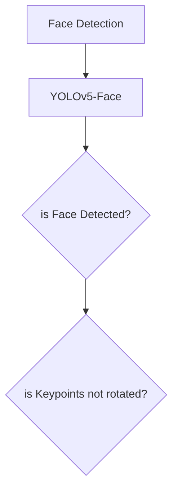

# Face Detection Failover systems

Face Detection that can detect face and correcting if face is rotated

```mermaid
flowchart TD;
    A[Face Detection] --> B[YOLOv5-Face];
    B --> C{is Face Detected?};
    C --> D{is Keypoints not rotated?};
    
```

cd ~

gsutil cp gs://aimlmodels/face_detection/yolov5face.zip .

unzip yolov5face.zip